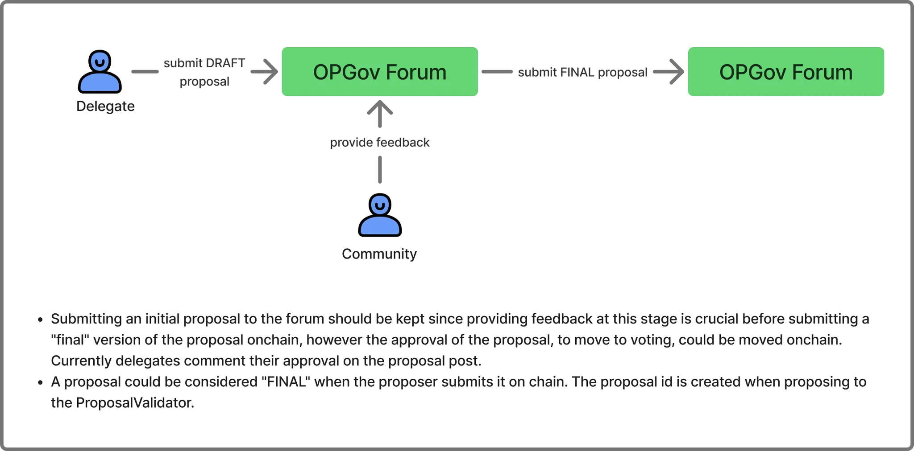

This section outlines the design for enabling permissionless proposal submissions in the Optimism governance system. The goal is to allow top delegates to submit proposals directly on-chain, without requiring manual approval from a manager, as long as specific automated rules are satisfied.

:::warning
This is still a work in progress.
:::

## Purpose

The governance process has historically included manual off-chain coordination: drafting proposals on the forum, gathering delegate approvals, and relying on a manager to post the proposal on-chain. This introduces unnecessary friction and centralization.

Permissionless proposals shift this process on-chain. Delegate approvals, voting thresholds, and eligibility checks are now enforced through smart contracts, ensuring trust-minimized execution while preserving necessary safeguards.

## Summary

The proposed architecture introduces a new contract: `DelegatesProposalValidator`. This contract acts as the single entrypoint for submitting proposals to the Governor. It validates each proposal based on:

- Delegate approval thresholds
- Submission window timing
- GovernanceType-specific logic
- Treasury distribution limits (for grant-related proposals)

Once all requirements are met, the validator forwards the proposal to the `OptimismGovernor`, initiating the normal voting process. This flow automates enforcement, eliminates manual gatekeeping, and allows for structured decentralization over time.

## Architecture and Flow

### `DelegatesProposalValidator`

This contract wraps the proposal submission functions (`propose()` and `proposeWithModule()`) and performs all required checks before forwarding a valid proposal to the Governor.

Its responsibilities include:

- **Delegate approvals**: Verifies that the proposal has received enough sign-offs from top 100 delegates. Both the number of signers and their minimum voting power are configurable.
- **Window enforcement**: Ensures proposals are submitted within a designated submission window relative to the current voting cycle.
- **GovernanceType validation**: Each proposal is tagged with a `GovernanceType`, which defines its eligibility rules, proposer constraints, and thresholds. There is no 1:1 mapping between GovernanceType and UI-facing proposal categories—one category (e.g., Protocol Upgrade) may have multiple GovernanceTypes depending on proposer roles and validation logic.
- **Distribution limit**: Applies to funding proposals—checks that the requested OP does not exceed a configured limit for the cycle.
- **Forwarding**: If all checks pass, the validator forwards the proposal to the Governor for voting.

## Workflow

1. **Draft proposal**: A delegate creates a draft on the [Optimism Forum](https://gov.optimism.io/) and collects community feedback.

2. **Proposal finalization**: Once ready, the delegate marks the post as “Final Draft” and triggers an on-chain transaction via `DelegatesProposalValidator`. This emits a `ProposalSubmitted` event, including metadata such as the `proposalId`. Agora listens to this event and surfaces the proposal in its UI.

3. **Delegate sign-offs via Agora**: Top 100 delegates can now approve the proposal directly in Agora. These approvals are submitted on-chain and tracked by the validator.

4. **Move to vote**: When the required number of approvals is reached, the “Sign” button in Agora becomes “Propose.” Any user can click it to call `moveToVote(...)`. The validator checks that all criteria are met and forwards the proposal to the Governor.

## Alternatives Considered

- **Forum-based sign-offs (Option 1)**: An earlier model allowed delegates to sign proposals directly from the forum once marked as “Final.” While feasible, this would fragment the experience across two UIs. Agora was chosen as the single source of truth for proposal status, reducing coordination friction.
- **Permissioned configuration (MVP)**: In the MVP, a permissioned role (Optimism Foundation) sets voting thresholds, cycle timing, and distribution caps. This is acceptable given the Foundation’s veto power, but future iterations could replace this with decentralized governance or an optimistic oracle.
- **Forum comment signatures**: Prior designs included off-chain signature collection with on-chain verification. This added UX complexity and potential for error, and was replaced by native on-chain approvals.

## Risks and Uncertainties

- **GovernanceType complexity**: GovernanceTypes may proliferate as the system expands, especially since different proposers (e.g., Foundation vs. delegates) may have different rules for similar proposal categories. Care must be taken to manage and communicate this complexity to avoid confusion.
- **Subdelegation ambiguity**: The system currently does not account for Alligator-style subdelegation. A delegate may appear in the top 100 due to delegated voting power, which may already be partially committed elsewhere—leading to unclear eligibility.
- **Centralized configuration authority (MVP)**: Governance parameters are currently set by a single role. Long-term decentralization remains a critical roadmap goal.

:::info reference
The PR is now **open**, read the specs [here](https://github.com/ethereum-optimism/design-docs/pull/260).
:::