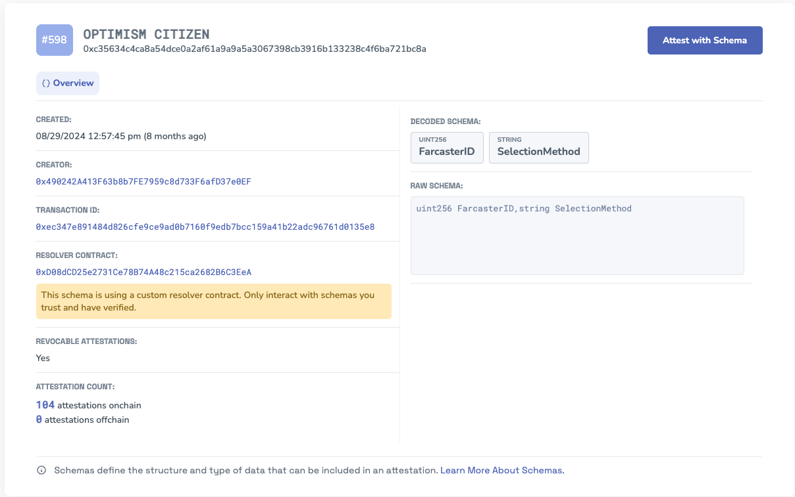

# The Operating Manual (v0.4.2)

In this section we will describe the current governance proposal process of the Collective. It will evolve over time. The authoritative version is maintained [here](https://github.com/ethereum-optimism/OPerating-manual/blob/main/manual.md) on GitHub.

## Bicameral Governance

The Collective is governed by two Houses:
- **Token House** handles most formal governance processes: protocol upgrades, OP allocation, representative elections, and proposal approvals.
- **Citizens’ House** governs the distribution of Retro Funding and can **veto** proposals like protocol upgrades and inflation changes to protect the Collective from plutocratic or short-sighted decisions.

They were designed to serve different roles, and to check and balance each other’s influence.

| House | Who votes? | Main Responsibilities | Voting System | Veto Powers |
|-------|------------|------------------------|----------------|--------------|
| **Token House** | OP holders & delegates | Protocol upgrades, treasury decisions, elections, governance proposals | On-chain Governor contract | Can veto some Citizen-led proposals |
| **Citizens’ House** | EAS-attested Citizens | Retro Funding, mission scoping, long-term legitimacy | Snapshot (off-chain) | Can veto upgrades or inflation proposals passed by Token House |

Together, this forms a bicameral system that balances **technical governance** with **public goods**. Certain proposals (like maintenance upgrades) require both Houses to participate, and others (like Retro Funding) are solely in the Citizens' domain.

## Governance Toolkit
| Tool | Description |
|------|------------|
| [Token House Governance Contract](https://optimistic.etherscan.io/address/0xcdf27f107725988f2261ce2256bdfcde8b382b10) | On-chain voting for Token House proposals |
| [Optimism Governance Portal](https://vote.optimism.io/) | Vote and delegate OP on-chain |
| [Citizens' House Snapshot](https://snapshot.box/#/s:citizenshouse.eth) | Vote interface for Citizens' House |
| [Optimism Forum](https://gov.optimism.io/) | Proposal discussion and feedback |
| [Discord](https://discord-gateway.optimism.io/) | Informal governance chat |
| [Grants GitHub](https://github.com/ethereum-optimism/ecosystem-contributions/issues) | Foundation Mission proposals and discussion |
| [Charmverse](https://app.charmverse.io/op-grants/page-701220845245208) | Home of the Optimism Grants Council |

These tools may change as governance evolves.

## Proposal Process

Anyone may submit a governance proposal if it fits one of the valid types (listed below) and follows the voting process.

Most proposals follow a three-week cycle:

- Week 1–2: Feedback and Review **[Draft]**
    - Proposals are posted to the Forum for community feedback.
    - Must be formatted per the standard proposal template.
    - Four top 100 delegates or four Citizens must explicitly approve for the proposal to move to vote.
    - They indicate this by commenting: *'I am an Optimism [delegate/Citizen] [link], and I believe this proposal is ready to move to a vote.'*

- Week 3: Voting
    -  Voting lasts 7 days via Optimism Governance Portal (Token House) or Snapshot (Citizens’ House).
    - Snapshot of voting power is taken at the start of the voting period.
    - Quorum and approval thresholds depend on the Proposal Type.

## Veto Process

Certain proposals can be vetoed by the other House:
| Proposal Origin | Veto House | Threshold |
|-----------------|------------|-----------|
| Token House (e.g. Protocol Upgrade) | Citizens' House | 30% of Citizens |
| Citizens' House Proposal | Token House | 30% of votable OP supply |

Vetoes are a serious mechanism, reserved for malicious proposals or cases of governance capture.

## Valid Proposal Types
| Proposal Type | Proposing House | Vote Duration | Quorum | Approval | Veto Rights |
|--------------|-----------------|---------------|---------|-----------|-------------|
| Governance Fund (Missions) | Token House | 2w review + 1w vote | 30% | 51% | — |
| Protocol / Governor Upgrade | Token House | 2w review + 1w vote | 30% | 76% | Citizens' House |
| Maintenance Upgrade | Both Houses | 1w optimistic vote | — | — | Both Houses (12%) |
| Inflation Adjustment | Token House | 2w review + 1w vote | 30% | 76% | Citizens' House |
| Director Removal (OP Foundation) | Token House | 2w review + 1w vote | 30% | 76% | — |
| Treasury Appropriation | Token House | 2w review + 1w vote | 30% | 51% | — |
| Rights Protections | Token House | 2w review + 1w vote | 30% | 51% | — |
| Code of Conduct Violations | Either | 2w review + 1w optimistic vote | — | — | Corresponding House (12%) |
| Representative Removal | Token House | 2w review + 1w vote | 30% | 51% | — |
| Structure Dissolution | Token House | 2w review + 1w vote | 30% | 51% | — |
| Ratification | Both Houses | 2w review + 1w vote | 30% | 51% | — |
| Reflection Period | Token House | 2w review + 1w vote | 30% | 51% | — |

See templates [this template](https://gov.optimism.io/t/standard-proposal-template-optimism-token-house/5443) for proposal types.
 
## Retro Funding

Retro Funding Missions are managed by the Citizens’ House and follow these steps:
1. **Scoping**: Vote on budget + mission scope.
2. **Application**: Projects apply via OP Atlas.
3. **Review**: Applications reviewed for eligibility.
4. **Voting**: Citizens vote on impact and allocate rewards.
5. **Disbursement**: Grants distributed to winning projects.
6. **Compliance**: Projects complete KYC and compliance review.

For example, Retro Funding in 2025 includes:
- **Onchain Builders Mission**: Up to 8M OP to support Superchain adoption and interop.
- **Dev Tooling Mission**: Up to 8M OP for foundational open-source infrastructure.

:::info reference
Find more information about the season [here](https://gov.optimism.io/t/season-7-retro-funding-missions/9295).
:::

## Experimentation with Citizenship

The Citizens’ House was created to:
- Counterbalance Token House plutocracy
- Reward long-term public goods
- Increase resilience via diverse representation

Experiments with Guest Voters are ongoing. The Citizen Attestation Schema tracks active Citizens.

Experiments follow this principles:
- Measurable inputs + outcomes
- Short feedback cycles
- Reversibility (e.g. guest voter rounds)

## Implementation & Administration

The Optimism Foundation:
- Moderates proposals and enforces submission requirements
- Monitors quorum and thresholds
- Administers emergency upgrades and manages network operations
- Routes approved proposals to implementation
- Collects compliance information

Over time, its role is expected to decentralize. Security-critical upgrades are enacted by the Security Council (SC).

## Change Process

The manual evolves alongside governance. Each release is versioned and published here. Future updates may include:
- New Proposal Types
- Expanded veto powers
- Full community maintenance

Only the removal of a Proposal Type requires a governance vote.