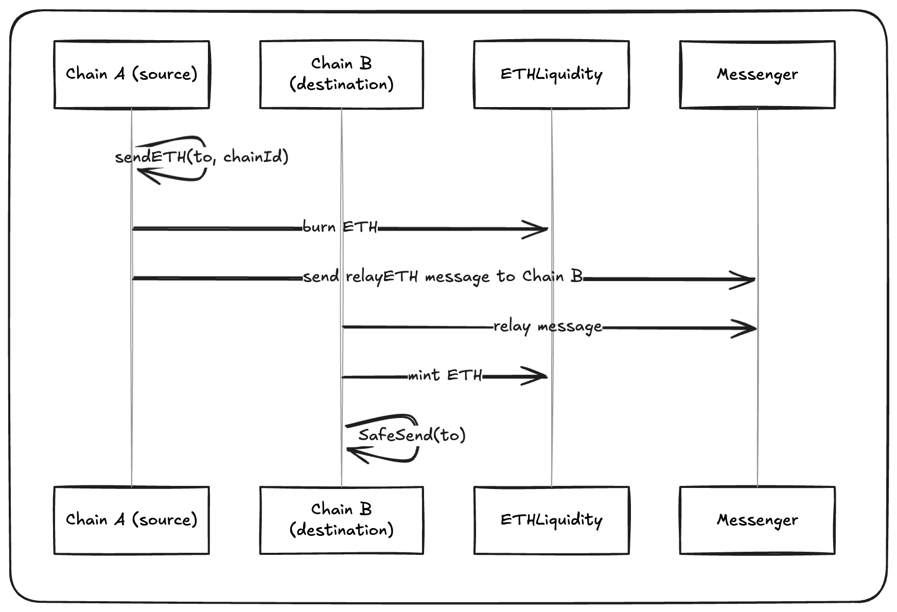

:::info reference
This is a high-level overview of how native ETH is transferred between OP Chains in the Superchain. For exact implementation details, see the [SuperchainETHBridge spec](https://specs.optimism.io/interop/eth-bridging.html).
:::

ETH Interop enables seamless, trust-minimized transfers of native ETH across chains in an interop cluster. The bridging system is implemented using three predeploy contracts:

- `SuperchainETHBridge`: the entry point for initiating and executing ETH transfers
- `ETHLiquidity`: an internal mint/burn pool to maintain supply integrity across chains
- [`L2ToL2CrossDomainMessenger`](messaging-protocol.md): handles message passing between chains

There are no wrapped assets. Bridging relies on native ETH balances and enforces strict mint/burn accounting guarantees.

## How ETH Interop Works

The flow follows a two-step pattern:

1. **Initiating Message**: A user sends ETH using `SuperchainETHBridge.sendETH(to, chainId)`, which burns the ETH locally by calling `ETHLiquidity.burn()`. A message is emitted and sent to the destination chain.
2. **Executing Message**: A relayer (e.g. autorelayer) calls `SuperchainETHBridge.relayETH()` on the destination chain. This mints ETH using `ETHLiquidity.mint()` and delivers it to the recipient via a forced transfer (`SafeSend`).

This mechanism avoids liquidity fragmentation while preserving ETH fungibility across all OP Chains.

## SuperchainETHBridge

The `SuperchainETHBridge` contract is the main interface for cross-chain ETH transfers. It uses the `L2ToL2CrossDomainMessenger` to send and verify messages. As an overview:

- `function sendETH(address _to, uint256 _chainId) external payable returns (bytes32 msgHash_)`: Burns the `msg.value` of ETH and sends a cross-chain message:
    - Reverts `if _to == address(0)`
    - Calls `ETHLiquidity.burn{ value: msg.value }()`
    - Sends `relayETH` message to the target chain
    - Emits `SendETH(from, to, amount, destination)`

- `function relayETH(address _from, address _to, uint256 _amount) external`: Mints ETH on the destination chain and transfers it:
    - Can only be called by `L2ToL2CrossDomainMessenger`
    - Verifies the message sender is the remote `SuperchainETHBridge`
    - Calls `ETHLiquidity.mint(_amount)`
    - Uses `SafeSend{value: amount}` to force-send ETH to _to
    - Emits `RelayETH(from, to, amount, source)`

We have a few security invariants that are:
- Only authorized messenger can call relayETH
- ETH must be burned on source before being minted on destination
- ETH cannot be sent to the zero address

## ETHLiquidity

The `ETHLiquidity` contract is a pre-funded mint/burn vault. It starts with a virtual balance of `type(uint248).max`, allowing `SuperchainETHBridge` to burn and mint without constraints.

Only the `SuperchainETHBridge` can call `burn()` and `mint()`:

- `function burn() external payable`: Locks ETH into the contract. Emits LiquidityBurned(caller, value).
- `function mint(uint256 _amount) external`: Sends ETH to the caller via SafeSend. Emits `LiquidityMinted(caller, amount)`.

## Forced Transfers with SafeSend

ETH is transferred using new `SafeSend{ value: amount }(to)`, a contract-based ETH send that disables fallback logic. This prevents reentrancy and unexpected side effects in recipient contracts.

`new SafeSend{ value: _amount }(payable(_to))`: Unlike `call{value:}` or `transfer()`, SafeSend guarantees ETH delivery without executing recipient logic through `selfdestruct`.

## Native ETH Supply Guarantee

ETH in circulation across the Superchain is always backed by ETH locked in L1. The lockbox contract on L1 enforces mint/burn constraints:
- Minting ETH on L2 requires ETH to be locked on L1
- ETH is burned on L2 before being released from the lockbox

This model avoids inflation and maintains total supply consistency across L1 and L2.

## Events

- `event SendETH(address indexed from, address indexed to, uint256 amount, uint256 destination);`
- `event RelayETH(address indexed from, address indexed to, uint256 amount, uint256 source);`
- `event LiquidityBurned(address indexed caller, uint256 value);`
- `event LiquidityMinted(address indexed caller, uint256 value);`

These events provide a verifiable record of the ETH bridging lifecycle and occur in the following order:

1. **`SendETH`** — emitted on the source chain when a user initiates the bridge by calling `sendETH`. This includes the destination chain and amount to be transferred.
2. **`LiquidityBurned`** — emitted immediately after, when ETH is burned using `ETHLiquidity.burn()` on the source chain.
3. **`RelayETH`** — emitted on the destination chain when the relayer successfully submits the executing message and `relayETH` is called.
4. **`LiquidityMinted`** — emitted when ETH is minted and sent to the recipient using `ETHLiquidity.mint()` and `SafeSend`.

Together, these logs form a complete audit trail across both chains for every ETH bridge transaction.