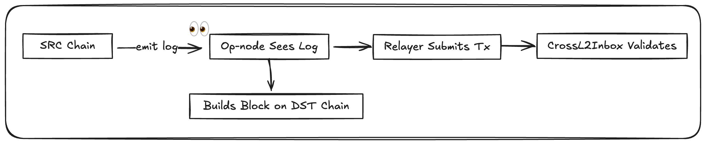

This section explains the foundational mental model of OP Stack interoperability, from how messages are emitted and consumed to the validation logic that makes them safe. 

When we say *interoperability*, we are talking about the ability of one chain to read and act on messages from another chain.

In the OP stack, interop is built into the protocol. Chains should be able to emit logs, call initiating messages, and other chains should be able to consume them as inputs to their own transactions. **This does not require routing through Ethereum L1.**

The goal of native interop is to reduce latency. Instead of waiting for a message to be posted and finalized on L1, chains can interact directly. This enables fast, low-cost messaging and allows applications to coordinate across chains in near real-time.

## The Problem

Standard rollup interoperability depends on Ethereum L1. Messages are posted as L1 transactions, then proven, then finalized. This process is expensive and introduces delays.

Native interop solves this by allowing chains to read logs from each other without going through L1. Safety is enforced by checking a fixed set of message invariants. Latency depends only on the destination chain’s view of the source chain.

## The mental model

Interop is based on events. One chain emits an event. Another chain sees it and takes action.

Each cross-chain message has two parts:
- **Initiating message**: A log emitted on the source chain.
- **Executing message**: A log emitted on the destination chain, pointing to the initiating message.

The source chain emits the message. The destination chain consumes it. The message is identified by a struct called `Identifier`:

```solidity
struct Identifier {
  address origin;
  uint256 blocknumber;
  uint256 logIndex;
  uint256 timestamp;
  uint256 chainid;
}
```
This identifier is used to prove that the message exists and that it has not expired.

### Validity

A message can only be consumed if it is valid. There are three invariants:
- **Timestamp**: The initiating message must have a timestamp less than or equal to the executing message.
- **Chain ID**: The source chain must be in the destination chain’s dependency set.
- **Expiry**: The message must be consumed within a fixed time window after it is created. This window is currently set to 180 days.

:::info 
If this time window elapses, the message can be re-sent on origin to make it available using `L2ToL2CrossDomainMessenger#resendMessage`. 
:::

If any of these invariants fail, the executing message is invalid. Any block that includes it will be reorged.

### Dependency Set

Each chain defines a list of other chains it depends on. This list is called the **dependency set**.

If a chain is in your dependency set, your node can read its logs and accept its messages. If it’s not, messages from that chain are ignored. This ensures that interop is explicit and permissioned.

Dependency sets are configured in the consensus client (`op-node`). They are updated through governance or software upgrades. Chains can be added to the set, but not removed, removing a dependency could break valid messages in flight.

Every chain includes itself in its own dependency set. This allows it to process its own logs (e.g. for retries or preconfirmations).

This configuration tells the node **which chains to watch**, **which logs to index**, and **which messages to validate and execute**. If a chain isn’t in the set, its logs are not considered valid sources for cross-chain messages.

:::info Can I just depend on OP Mainnet?

No. Each chain’s dependency set must explicitly include the chains it wants to receive messages from. Depending only on OP Mainnet does *not* automatically grant interoperability with every other OP Chain.

To enable seamless interop, chains should include all intended counterparties in their dependency set. This is why Superchain clusters aim to configure **fully connected meshes**, where every chain includes all others.
:::

### Who *enforces* interop?

Most of the interop logic is enforced by the **consensus node software**, not by contracts.

- The **`op-node`** watches logs from all chains in its dependency set. It reconstructs `Identifier`s, verifies message metadata, and builds L2 blocks that include valid cross-chain messages.
- A **relayer** (often part of the node stack) submits executing messages to the destination chain using functions like `relayMessage()` or `relayETH()`.
- The **verifier** continuously evaluates blocks and dependencies. It promotes blocks from `unsafe` to `safe` once their cross-chain messages are fully resolved and the relevant data is published.



The EVM cannot natively read logs from other chains — so this validation must be done by nodes off-chain. That’s why correct configuration of `op-node` and dependency sets is critical to interop safety.
