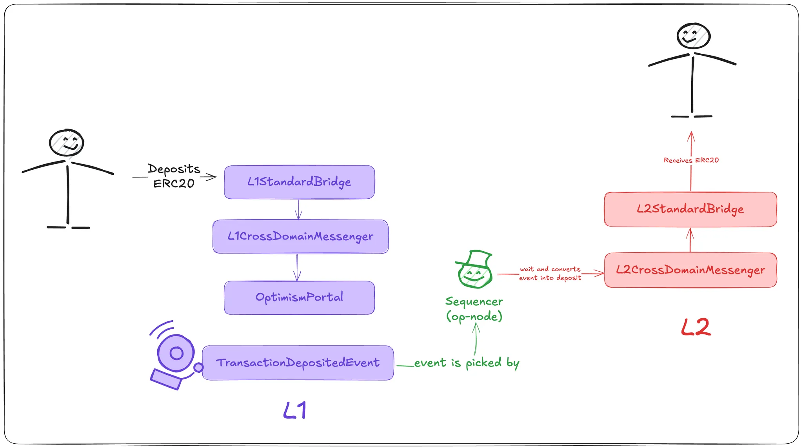

# Deposit Flow

:::info Reference
Find the full documentation [here](https://docs.optimism.io/stack/transactions/deposit-flow).
:::

We have a user who wants to deposit an ERC-20 token from L1 to L2. To do that, they call a function on the [`L1StandardBridge`](https://github.com/ethereum-optimism/optimism/blob/cd2b0c13ca993d95422c447fce0e14227b50a5cb/packages/contracts-bedrock/src/L1/L1StandardBridge.sol), which sends a message through the [`L1CrossDomainMessenger`](https://github.com/ethereum-optimism/optimism/blob/cd2b0c13ca993d95422c447fce0e14227b50a5cb/op-e2e/bindings/l1crossdomainmessenger.go#L63) and then into the [`OptimismPortal`](https://github.com/ethereum-optimism/optimism/blob/cd2b0c13ca993d95422c447fce0e14227b50a5cb/packages/contracts-bedrock/src/L1/OptimismPortal2.sol).

Behind the scenes, this triggers a call to `depositTransaction(...)`, the entrypoint that logs the deposit event to be picked up on L2.

Now, all the L2 nodes will be listening to the deposit events, and the sequencer will decide when to include it. We use the `OptimismPortal` for this. The events are not going to be processed immediately, to reduce the chances of reorgs.

:::info What happen if the sequencer is down?
Even when the sequencer is down; deposits are forced to be included “eventually”. Currently the force-deposit window is done after 12h.
:::

After waiting, it will pack the information into a transaction that will go to the [`L2CrossDomainMessenger`](https://github.com/ethereum-optimism/optimism/blob/cd2b0c13ca993d95422c447fce0e14227b50a5cb/packages/contracts-bedrock/src/L2/L2CrossDomainMessenger.sol) , that interacts with [`L2StandardBridge`](https://github.com/ethereum-optimism/optimism/blob/cd2b0c13ca993d95422c447fce0e14227b50a5cb/packages/contracts-bedrock/src/L2/L2StandardBridge.sol#L17) and woho! the user gets its ERC-20s.

### How is inclusion enforced?

The deposit is enforced by inclusion in a future L2 block as a special transaction. All L2 nodes, including honest verifiers, watch for L1 deposit events and reprocess them deterministically. If a sequencer ever fails to include a valid deposit, its blocks would be rejected by verifiers.

That’s why the system guarantees that valid L1 deposits will eventually be processed, either voluntarily by the sequencer or forcibly after the timeout.

:::info Reference
For further reference about smart contracts see [L2BEAT OP Mainnet](https://l2beat.com/scaling/projects/op-mainnet#contracts)
:::

