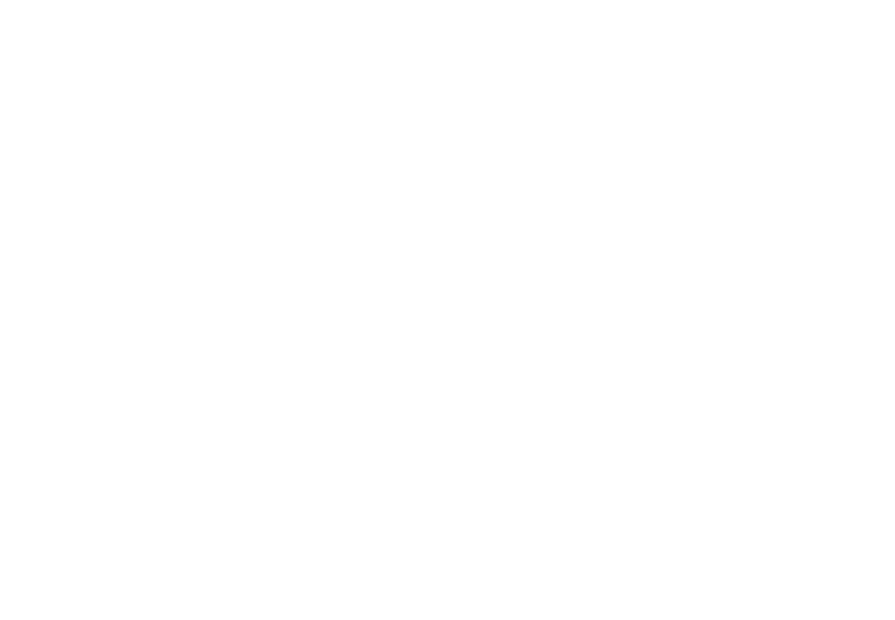
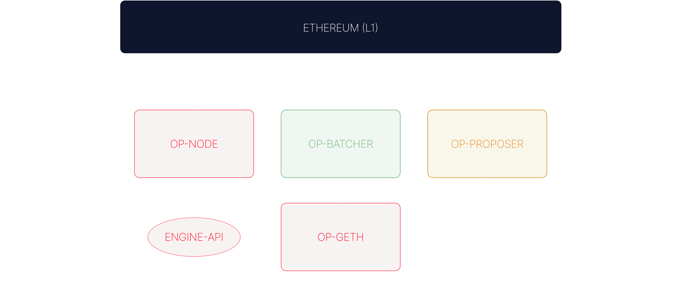

# The OP Stack

The OP Stack is what happens when you take the theory of modular rollups and turn it into software.

It’s built on the idea that different parts of the system should be decoupled, upgradeable, and independently verifiable. This design unlocks scalability, fault tolerance, and client diversity.


  <div style={{
    position: 'relative',
    paddingBottom: '56.25%',
    height: 0,
    overflow: 'hidden',
    maxWidth: '100%'
  }}>
    <iframe 
      style={{
        position: 'absolute',
        top: 0,
        left: 0,
        width: '100%',
        height: '100%'
      }}
      src="https://www.youtube.com/embed/jnVjhp41pcc?si=C5wRRNW50vDASVX1"
      title="YouTube video player"
      frameborder="0"
      allow="accelerometer; autoplay; clipboard-write; encrypted-media; gyroscope; picture-in-picture; web-share"
      referrerpolicy="strict-origin-when-cross-origin"
      allowfullscreen>
    </iframe>
  </div>

The architecture follows a clear flow: data is posted, understood, executed, and validated. The stack implements this flow through three primary layers:

## Consensus Layer

This is where the system consumes and interprets the data published to Ethereum. The two core components of this layer are **Data Availability** and **Derivation**.

### Data Availability

This is the raw input: an ordered list of blobs or calldata entries that describe what happened in the rollup. The format is effectively:

```solidity
type DA = bytes[];
```

The data must be *append-only* and *publicly accessible*. On Ethereum, this usually means calldata in L1 transactions or EIP-4844 blobs. Blobs are large chunks of data attached to blocks, designed to store L2 transaction data more efficiently.

:::info
EIP-4844 (proto-danksharding) introduces blobs as a cheaper, scalable form of data availability. You can think of it as native DA for rollups.
:::

### Derivation

The derivation component consumes the DA and produces execution payloads.

Formally, it’s a function like:

```text
derive(S_prev, DA) → { payload | null }
```

It takes the previous rollup state and the new data, and attempts to derive a payload that represents the next block. If there’s nothing new to execute, it returns null and loops back.

In OP Stack, the derivation process pulls data from three sources:

- **Sequencer batches**, posted to a designated L1 contract
- **L1 deposits**, emitted by the Portal contract
- **L1 block metadata**, like timestamps or block hashes

Once parsed, this data is turned into an `engine-api` payload, a standardized format used to communicate between consensus and execution clients.

:::info
The OP Stack uses the [engine API](https://github.com/ethereum-optimism/optimism/blob/bdde878b12057ab2e8d596aa7f33fa388ccf6641/op-wheel/engine/engine.go), just like Ethereum. It’s the glue that allows `op-node` (consensus) to instruct `op-geth` (execution) to build or validate blocks.
:::

## Execution Layer

Once a payload has been derived, it gets passed to the execution engine, typically `op-geth`, a fork of Geth with rollup-specific logic added.

Execution applies the payload to the current state:

```text
execute(S_prev, payload) → S_next
```

Together, derivation and execution form the **state transition function**. They loop continuously:

1. Wait for new data  
2. Derive payload from it  
3. Execute payload and update state  
4. Repeat

If a block has no new data, derivation returns null and no state transition occurs.



Most of the time, `op-geth` behaves just like the EVM. The main difference is support for special transaction types, especially **deposit transactions**, which allow contracts and users on L1 to trigger actions on L2.

## Settlement Layer

Settlement is about proving claims about your chain *to another chain*. It’s the trust interface: the mechanism that says, “Here’s what happened on L2, and here’s the evidence to back that up.”

The most common claim is a **state root**, a commitment to the entire state of the L2. To verify this claim, you need:

- Previous and next state roots: `S_p`, `S_n`
- The relevant data: `DA`
- The derivation and execution functions

```text
valid(S_p, S_n, DA, derive, execute) → boolean
```

This is the heart of fault proofs or validity proofs. You take a proposed transition, re-execute it offchain (or onchain via MIPS), and check if the outcome matches the claimed next state. If not, the proof fails.

:::info
In Bedrock, validation happens by walking *backward* from the latest block. This allows us to pinpoint the earliest invalid state transition and zoom in, all the way to a single EVM step, if necessary.
:::

There’s one final nuance: for a commitment to be provable, the underlying data must be available. So this function:

```solidity
getBlobByIndex(uint256 index) → bytes
```

is not just an implementation detail, it’s a trust assumption. If you can’t access the data, you can’t prove or dispute anything.

## Summary
All of this can be summarized to the following chart, with the actual ‘players’ of the stack:



The `op-node` is the consensus layer, and will control the execution layer through the `engine-api` (which we mentioned before). `op-batcher` is responsible for posting the L2 blocks data to the DA Layer. Then, the `op-proposer` used to post output roots —it depends on the chain, some already use permissionless fault proofs. So, we can divide it into the following components:

- **Data Availability:** it is by default Ethereum (either blobs or calldata) while `op-batcher` is responsible for sending the L2 data to Ethereum.
- **Sequencing:** by `op-node` and `op-geth.`
- **Derivation: b**y `op-node`.
- **Execution:** by `op-geth`.
- **Settlement:** L1 or offchain (`op-challenger`, `DisputeGame`)
- **Governance**

:::info
The stack is modular and evolving. Expect new components, alternative clients, and additional governance layers to appear over time.
:::
