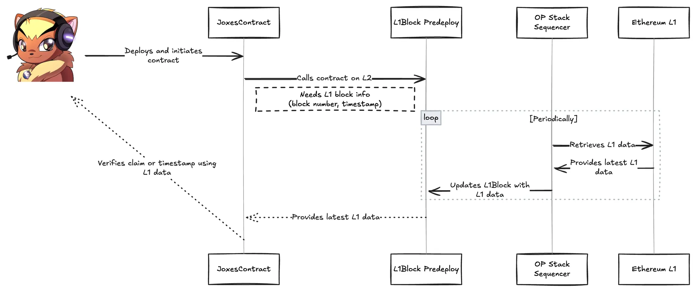
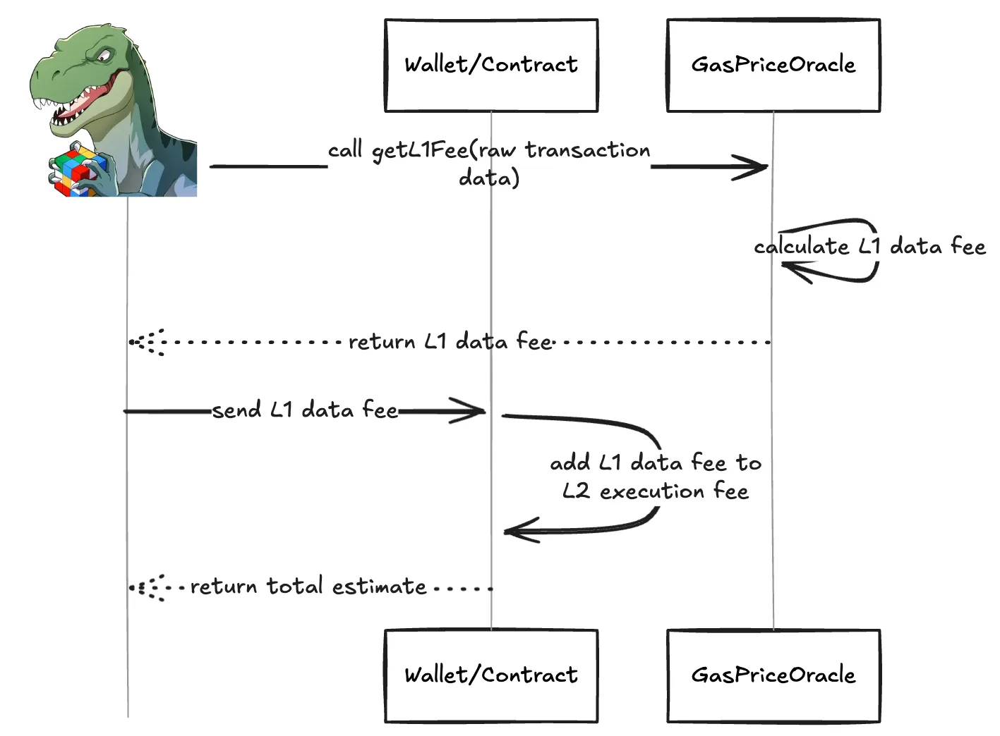
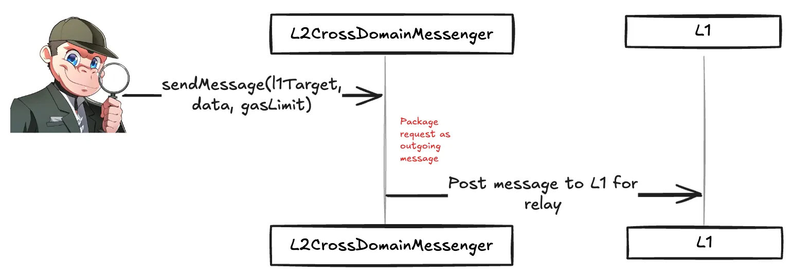
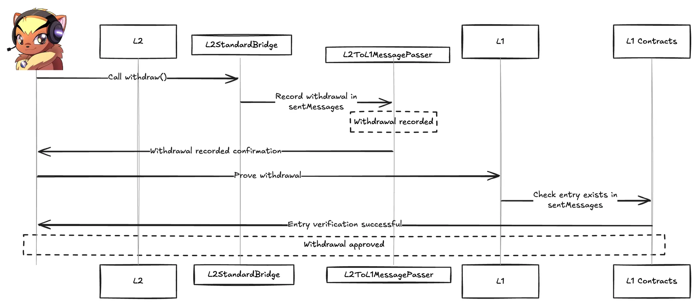

## Precompiles

:::info
Precompiled contracts (aka precompiles) are special addresses at which *native* code runs (rather than bytecode). They’re used for expensive ops that would be too inefficient in raw Solidity.
:::

OP Stack includes all the standard Ethereum precompiles, plus a few extras. Whenever possible, the protocol team prefers predeploys over precompiles, so that you can just upgrade a contract. Precompiles require a network upgrade.

The additional one is P256VERIFY, with the address `0x0000000000000000000000000000000000000100` . It implements signature verification for secp256r1, defined under the [RIP-7212](https://github.com/ethereum/RIPs/blob/master/RIPS/rip-7212.md). 

## PreDeploys

:::info
https://specs.optimism.io/protocol/predeploys.html
:::

They are special contracts that exist at **fixed addresses** right from a chain’s genesis. Unlike **precompiles**, they run directly in the EVM (bytecode), not as native code. This makes them easier to maintain across multiple clients and also easier to work with in Hardhat/Foundry network forks.

The predeploys are usually under the address `0x4200000000000000000000000000000000000xxx` . Some predeploys are *legacy* and have been deprecated or replaced in Bedrock. It is important to note that many of these predeploys are actually proxy contracts. 

:::info
**Special Legacy ERC20 ETH**: One predeploy (`0xDeadDeAd...DeAD0000`) is not proxied and was used to represent ETH **before** the Bedrock upgrade.
:::

Every time an L2 user on an OP Stack chain wants to send messages or withdraw funds back to L1, he/she will interact with several key predeploys. 

1. **Checking L1 info via `L1Block` (**`0x4200000000000000000000000000000000000015`)
    
    Let’s say that Joxes starts on L2 but needs up-to-date L1 data to verify a claim or timestamp in his contract.
    
    For doing that, Jox will call the `L1Block` contract on L2 and this predeploy will be the *source of truth* on L2 for L1 block info. Behind the scenes, the sequencer periodically updates L1Block, and Joxes’s contract can then read the `blockNumber()` , timestamps, etc. 
    
    
    
2. **Estimating Fees with `GasPriceOracle` (`0x420000000000000000000000000000000000000F` )**
    
    Now, let’s say that Rex wants to send a cross-domain transaction to L1 (or maybe just a regular L2 transaction), and he need to know how much gas it’ll cost.
    
    For doing that, we will need to use the GasPriceOracle. So, Rex will call `getL1Fee(bytes)` on the contract, passing the raw transaction data. Then it will calculate the L1 data fee portion of the cost (essentially, the extra overhead for storing L2 transaction data on L1). Then Rex’s wallet or contract can add this to the normal L2 execution fee to get.a total estimate.
    
    
    
:::info 
Without it, Rex would have to manually guesstimate the overhead for posting transaction data on Ethereum, so this predeploy automates it for him : )
:::
    
3. **Sending a message out with `L2CrossDomainMessager` (`0x4200000000000000000000000000000000000007` )**
    
    It seems like the whole research team needs to do things with predeploys! Now, Mono wants to instruct some L1 contract (an automated vault for example, or a bridging contract) to do something on his behalf. He will need to send a cross-domain message from L2 to L1. 
    
    First, he will call `L2CrossDomainMessenger.sendMessage(l1Target, data, gasLimit)` . Under the hood, the `L2CrossDomainMessenger` packages this request as an outgoing message and eventually posts it to L1 for relay. 
    
    
    
:::important
We could say that the `L2CrossDomainMessenger` is our higher-level API that does the heavy lifting of sending messages across domains.
:::
    
4. Recording the Withdrawal with `L2ToL1MessagePasser` (`0x4200000000000000000000000000000000000016`)
    
    We go back to Jox, he said *‘know what? I’m done on L2 for now’*, and he wants to withdraw some ETH back to L1. He will initiate the withdrawal calling `L2StandardBridge.withdraw()` for example, and it eventually calls the `L2ToL1MessagePasser` to record the withdrawal in `sentMessages`.
    
    This record is important because when he later proves the withdrawal on L1, the L1 contracts check that this entry exists.  
    
    We could explain`L2ToL1MessagePasser` saying that it is a *ledger* on L2 that says, *“Yes, Joxes did request a withdrawal. Here’s the relevant info.”.*
    
    
    
:::important 
Without the `L2ToL1MessagePasser`’s record, there’s no evidence on L2 that Joxes started a withdrawal. L1 would have no way to verify the claim.
:::

:::info reference
For a reference on predeploys, go [here](https://specs.optimism.io/protocol/predeploys.html)
:::
