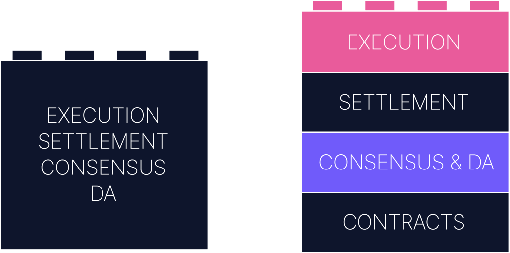

# Previous knowledge

Before we dive into the OP Stack itself, it’s important to make sure we’re grounded in some core concepts. This section revisits a few foundational ideas about Layer 2s, blockchain reorgs, and modular architectures. If you already understand how rollups work, feel free to skim. If you’re new to Optimism or haven’t thought deeply about these mechanisms in a while, take the time to read through. The OP Stack builds on these principles in very intentional ways.

## Layer 2s

Layer 2s are networks that scale Ethereum by outsourcing computation and execution, while still inheriting security guarantees from Ethereum as a Layer 1. They do this by anchoring their activity to Ethereum in two key ways: through **state commitments** and **data availability**.

- **State commitments** are cryptographic commitments to the state of the L2, published to the L1 at regular intervals. These commitments act as snapshots of the L2’s canonical state at a particular point in time. They allow other systems, like bridges or settlement contracts, to verify whether certain facts about the L2 are true.

:::info
State commitments are what allow users and contracts on L1 to trust data coming from L2. For example, to finalize a withdrawal, a bridge must verify that the requested transaction really happened, which it does by checking the relevant state commitment.
:::

In optimistic rollups like OP, these commitments are posted *without* validity proofs. Instead, they rely on **fraud proofs** and a **challenge window**, typically 7 days. During this period, anyone can challenge the commitment if they believe it represents an invalid state transition. If no one challenges it, the commitment becomes final.

:::info
The rollup inherits security from Ethereum because all state transitions ultimately get posted and resolved there. If Ethereum is secure, and the rollup’s fraud proof system is well-designed, then the L2 can be secure too.
:::

### What makes a state commitment trustworthy?

Not all commitments are created equal.

A state commitment is a hash. What matters is what it commits *to*. In the OP Stack, that commitment takes the form of an **output root**, which itself is derived from several components: the L2 state root, the storage root of the withdrawal contract, the latest block hash, and a version number. These are packed together and hashed into a single value posted to L1.

This means that the commitment isn’t just a snapshot of the current state, it’s a summary of all the things that matter for safety and interoperability: whether a withdrawal was initiated, what block it came from, and how it ties back to the current L1.

The commitment becomes trustworthy if:
- The DA layer contains the data needed to reconstruct the transition
- The derivation function is deterministic and publicly executable
- The fraud proof system allows anyone to dispute invalid transitions

Ultimately, what we trust is the process that *led to the commitment*, not just the commitment itself.

- **Data availability** refers to where the raw transaction data for the rollup is stored. This data must be publicly available so that any honest participant can independently reconstruct the state. If an L2 posts all data to Ethereum, it’s considered to have **Ethereum-native DA**. If it uses an external provider like Celestia, it’s relying on **offchain DA**.

:::warning
Posting data somewhere other than Ethereum can reduce cost, but it introduces new trust assumptions. An L2 that doesn't use Ethereum for DA isn’t uniquely secured by Ethereum anymore.
:::

### DA: What are you really trusting?

DA is often treated as a checkbox: *Did you post the data?* But it’s worth asking: who can access it, and how soon?

If your rollup posts to Ethereum calldata or EIP-4844 blobs, then *anyone* running an Ethereum node can access it. That means fraud proofs, clients, and users can all verify the chain independently. This is what makes Ethereum-based DA a “public good.”

If instead the rollup uses an external service like Celestia or EigenDA, it’s trusting another network to make the data retrievable, either by sampling (in the case of erasure-coded blobs) or by assuming that a quorum of nodes keeps it online. That’s not necessarily bad, but it’s a different trust model.

The *real question* is: can you reconstruct the state if you're not the sequencer?

:::tip What is a sequencer?
A **sequencer** is the component responsible for ordering and executing transactions on the L2. In the OP Stack, it runs both `op-node` and `op-geth`. It builds blocks, runs the EVM, and sends the resulting state commitments and transaction data to Ethereum. 
:::

Rollups are only meaningfully decentralized if *anyone* can recompute and verify the current state. DA makes that possible.

### Is the sequencer just one node?

When people say “the rollup has a single sequencer”, they mean there's one entity authorized to produce new L2 blocks. That entity runs a stack including `op-node`, `op-geth`, `op-batcher`, and `op-proposer`. It’s not just one machine, but one authorized operator with the exclusive right to publish canonical L2 blocks.

However, anyone can run their own full node or verifier. These nodes re-derive the chain from public data, validate the sequencer's work, and can challenge incorrect output proposals in systems with permissionless fault proofs.

Sequencer decentralization is a future goal of the OP Stack. The current design keeps it centralized for simplicity and stability, but the architecture is modular enough to support decentralized sequencing via elections or shared slots.

## Reorgs

A **reorg**, or chain reorganization, happens when a node discovers a longer chain than the one it was previously following. In blockchains, the longest valid chain is the canonical one. So, when a longer version appears, the node switches over. 

That means any transactions in the abandoned segment are effectively “rolled back.” They’re no longer part of the chain’s history unless re-included in later blocks.

Reorgs are rare on Ethereum, but they *can* affect systems built on top of it, especially rollups that listen to L1 events. For example, if a user makes a deposit to L2 and it’s included in an L1 block that gets reorged out, the rollup must reprocess the deposit when it reappears in a new block. That’s why certain operations on the OP Stack, like deposits, aren’t processed immediately, but only after a buffer period.

### The anatomy of a reorg

Let’s say Alice sends a deposit to the `L1StandardBridge` (we will see what is that exactly later), and it lands in block `N`. The OP Stack’s sequencer is watching Ethereum and sees that deposit event, so it includes it in the next L2 block.

But then, something happens on Ethereum. A validator reveals a longer chain that *doesn’t* include block `N`, maybe because of latency, or a fork choice change. Now, block `N` is no longer part of the canonical chain. That means Alice’s deposit technically didn’t happen.

The OP Stack needs to recognize this and *rewind* its local state accordingly. When block `N` is replaced by a new block `N_1`, the sequencer replays the events and will only re-include the deposit if it appears again.

This is why deposits don’t get included instantly. The system waits for a few blocks, typically 12 minutes or so, to reduce the chances of processing an event from a chain that might get reorged away.

Rollups are reorg-sensitive because they rely on the finality of the base layer. But with careful handling, the risk can be minimized.

## Modular rollup architecture

Ethereum started out as a **monolithic chain**, meaning it handled all major functions within a single system: consensus, execution, data availability, and settlement. This made it easier to reason about, but harder to scale. Every node had to do everything.

The OP Stack follows a **modular architecture**, which decomposes those responsibilities into discrete layers, each with its own specialized role.

You can think of a modular rollup as a distributed system of smaller parts:

- A **data availability layer** ensures that transaction data is published and retrievable.
- A **consensus layer** orders that data and helps generate blocks.
- An **execution layer** takes transactions and computes new state.
- A **settlement layer** validates claims about the system from outside (typically on L1).

Each component can be upgraded, swapped out, or scaled independently. For example, you could use Ethereum for DA, but eventually move to a different DA provider. Or you might change your execution engine to support a different VM.

If you’re wondering how these abstract layers map to real OP Stack components (`op-node`, `op-geth`, or `op-batcher`) don’t worry, that’s exactly what we’ll cover in the next section. We’ll walk through each layer and show how the software fits together to form the full system.
