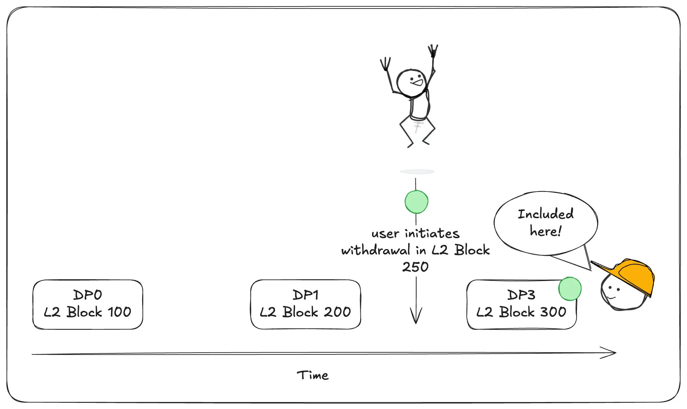
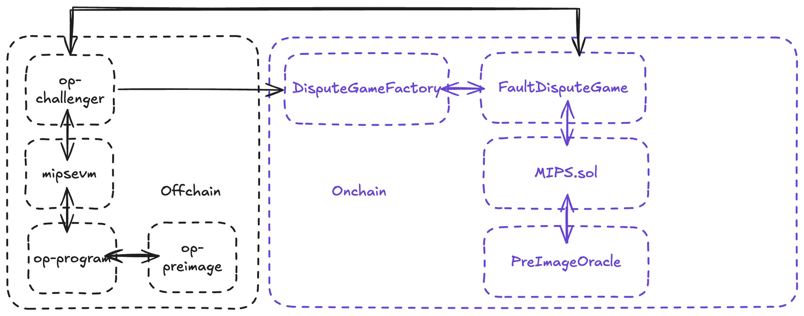

:::info Reference
Find the full documentation [here](https://docs.optimism.io/stack/transactions/withdrawal-flow).
:::

Withdrawals start on the L2, and there are 4 key steps: initiate, prove, finalize and asset release. So, the user will initiate withdrawal when interacting with the `L2StandardBridge` , it will communicate with `L2CrossDomainMessenger` that will go to `L2ToL1MessagePasser` . The last one is the important piece, because it is this contract’s storage root that is used to prove the withdrawal on L1. The user, after initiating the withdrawal on L2, will need to prove the withdrawal on L1. They will call `prove_withdrawal` on OptimismPortal2, and after that, they will need to wait for the challenge period. Only after that, the transaction is finalized and the user gets their assets.

Now, because OP Stack has permissionless fault proofs, the process involves a DisputeGame mechanism. So, actually when proving, they wouldn’t be able to do this immediately. When initiating the withdrawal, we need to wait for 1 hour. This is because we need to wait for a dispute game that contains the withdrawal.

Let’s assume that 1 hour = 100 blocks. The timeline would be:

So, the user will need to wait until the DP3, which actually includes its withdrawal. The reason that this is 1 hour is that the proposer has the responsibility of create the dispute game every hour. So, users can conveniently reference the dispute game that were created by the proposer when they want to prove their withdrawal. 

Although the user initiates the withdrawal at L2 block 250, they cannot immediately prove it on L1. They must wait until a Dispute Proposal is published that covers L2 block 250. In this case, DP3 includes the state up to L2 block 300, which means it is the first DP that contains the withdrawal in its state root. This allows the user to construct a valid proof and initiate the dispute game on L1.

### How is this enforced?

When proving a withdrawal, the user supplies a Merkle proof showing that their message was recorded in the `L2ToL1MessagePasser` contract. This storage root is part of the output root posted to L1 (via the `Proposer`), and the `OptimismPortal.proveWithdrawalTransaction()` function verifies the inclusion.

If the proof is valid and unchallenged during the dispute window, the withdrawal can be finalized. This ensures that L1 only processes withdrawals that were genuinely recorded in L2 state.

You might be asking: how is security guaranteed? The dispute game mechanism involves disputes that contain claims about the L2 state. The claim rests upon the Output Root which contains the state root and the storage root. There are 2 components (onchain and offchain):

**op-challenger** will monitor the dispute games that are created, if there is something that could be invalid, it will trigger the `DisputeGameFactory` and start the cycle. This kicks a FaultDisputeGame. The dispute starts broad, challenging the full state commitment, and progressively zooms in until the disagreement is reduced to a single execution step. Then, MIPS.sol steps in to resolve the dispute deterministically by executing the disputed instruction on Ethereum itself. 

Cannon is the vm (`mipsevm`), and it will ensure that the same computation can be run both offchain and onchain. Then, the PreImageOracle is used to fetch the required cryptographic inputs to make the execution reproducible. If the onchain execution confirms that the original proposal was incorrect, the challenge succeeds, and the invalid state is rejected.

:::info Visual learner?
If you are more about visual learning, we suggest you to watch:

  <iframe 
    style={{
      position: 'absolute',
      top: 0,
      left: 0,
      width: '100%',
      height: '100%'
    }}
    src="https://www.youtube.com/embed/nIN5sNc6nQM?si=0y4apBvCDUH-nnyj"
    title="YouTube video player"
    frameborder="0"
    allow="accelerometer; autoplay; clipboard-write; encrypted-media; gyroscope; picture-in-picture; web-share"
    referrerpolicy="strict-origin-when-cross-origin"
    allowfullscreen>
  </iframe>

:::